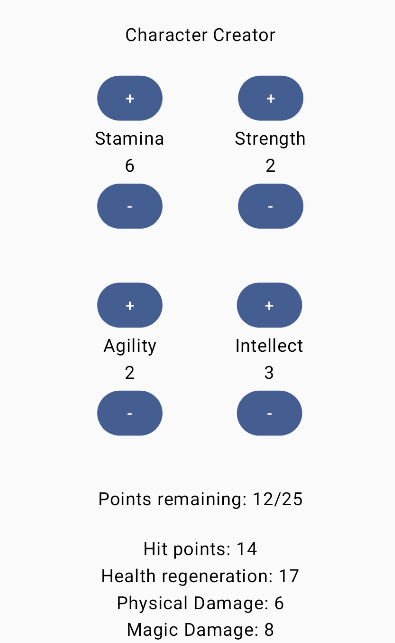

# Project 2 - Character Creator

## Overview

We're making a Character Creator app where we will spend points in various stats, and that will give the character values for hit points, health regeneration, physical damage, and magic damage.



## Stats
There will be 4 stats: Stamina, Strength, Agility, and Intellect. These stats will then be used to calculate various character attributes like hit points, defence points, damage, etc.

For each stat, you will have two buttons to increment or decrement the stat. There will be a total pool of stat points (eg. 25 total) and when the max is reached, the stats will not increase, but they can decrease.

## Remaining Points
After the stat buttons, output how many points the user has left to spend.

## Display Character Values
At the bottom of the app, you will display the character values based on the stats. You should have four values: Hit Points, Health Regeneration, Physical Damage, Magic Damage. These are calculated like:
```
hit_points = 2 * stamina + strength
health_regen = 2 * stamina + (agility + intellect)
phys_damage = 2 * strength + agility
magic_damage = 2 * intellect + agility
```

## Turn-in and Grading
Take a screenshot of your app, either on the emulator or preview tab. Zip the screenshot with your entire Android Studio project and upload it to Dropbox. This project is worth 25 points, distributed as follows:


| Task                                                                                                              | Points |
|-------------------------------------------------------------------------------------------------------------------|-|
| App has four sets of buttons to increment/decrement stats                                                         | 5 |
| Stats are mutated by the increment/decrement buttons                                                              | 5 |
| Sum of stats do not go over max (you can use 25) points, and do not drop below zero                               | 5 |
| Display how many points are remaining to spend (max - sum of points)                                              | 5 |
| Outputs the character values based on the stats the user inputs (Hit Points, Health Regen, Physical/Magic Damage) | 5 | 


